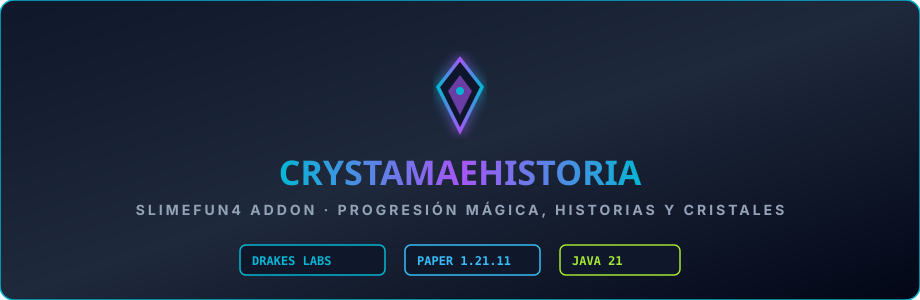

  

# CrystamaeHistoria-drake

Addon temático de **Slimefun 4** enfocado en la narrativa mística, eventos de cristales elementales, reliquias arcanas y utilidades mágicas complementarias. Portado, optimizado y mantenido por **DrakesCraft Labs** para Paper/Purpur 1.21.11 en Java 21.

---

## 🎯 Objetivo

Extender la variedad narrativa y las mecánicas mágicas en el servidor, ofreciendo a los jugadores una ruta de investigación paralela a la tecnología industrial basada en la resonancia y purificación de cristales.

---

## ⚡ Características Principales

- **Sistema de Historias y Eventos Místicos**:
  - Progresión guiada a través de capítulos mágicos y descubrimientos arcanos.
- **Cristales Elementales y Resonadores**:
  - Nuevas gemas y catalizadores mágicos para potenciar equipamiento y herramientas.
- **Efectos Visuales Seguros**:
  - Efectos de partículas fluidos totalmente compatibles con Paper 1.21.11 sin saturar la red ni causar lag de renderizado.

---

## 🛠️ Entorno y Compatibilidad

- **Servidor**: Paper / Purpur 1.21.11
- **Java**: 21
- **Dependencias**:
  - `Slimefun4-Drake`

---

## 📜 Créditos

- **Comunidad Slimefun & Autores Originales**
- **Adaptación y Mantenimiento 1.21.11**: **DrakesCraft Labs**
